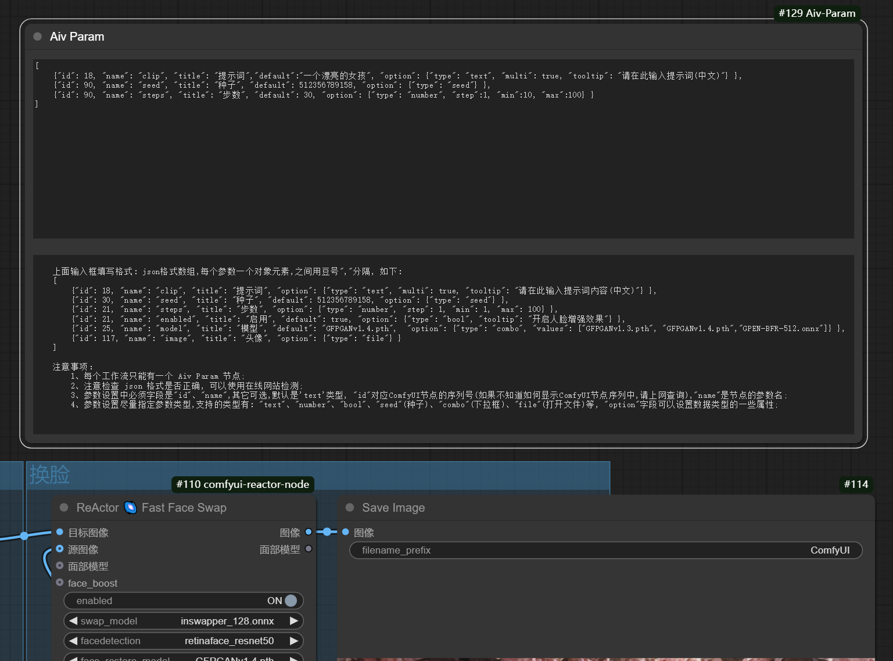

# AIV Comfyui Node
  2025.1

## 用于ComfyUI的扩展节点
  用于把工作流的节点设置转化成AIV小程序的参数
  

## 作用
  开发者通过 AivApp 节点,把需要设置的参数集中后,展示在前端,由用户修改,最后输出到工作流中。达到可以动态修改工作流参数的目的

  Aiv Param 使用js代码与前端交互,在用户录入json字符格式时,自动检测是否是json正确格式

  这个Node节点配合Aiv平台的python包sdk开发包: aivagent https://pypi.org/project/aivagent/,方便把AI应用发布到小程序、web应用、app原生应用

  ## 联系:
    QQ: 76881573
    Q群: 965485665